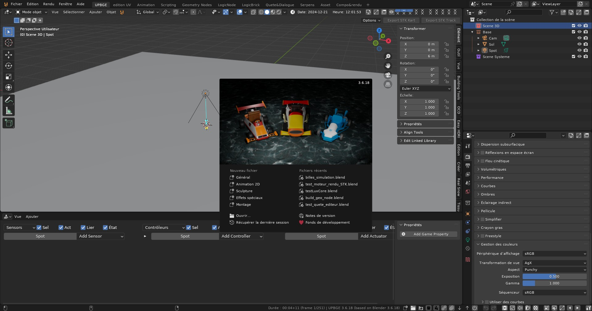
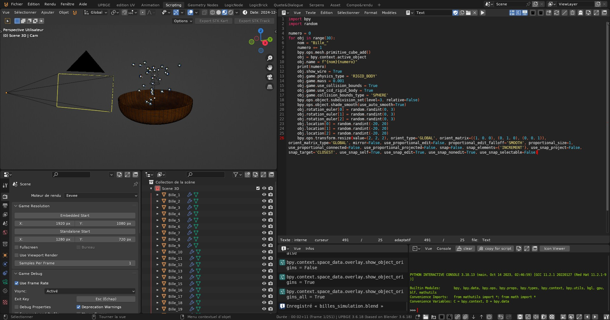

# upbge-36.next

il s'agit d'un projet qui à pour but de faire la mise à jour de UPBGE0.36 avec les dernière version de la série Blender 3.x afin d'avoir les correctif et amélioration pour le moteur de jeu.

base Blender
=======

Blender est la suite de création 3D gratuite et open source.
Il prend en charge l'intégralité du pipeline 3D:
modélisation, rigging, animation, simulation, rendu, compositing, suivi de mouvement et montage vidéo.

Pages Projet
-------------

- [Blender Site Web](http://www.blender.org)
- [Manuel de Référence](https://docs.blender.org/manual/en/latest/index.html)
- [Communité d'utilisateur](https://www.blender.org/community/)

Dévelopement
-----------

- [Instructions de construction](https://developer.blender.org/docs/handbook/building_blender/)
- [Révision du code et suivi des bogues ](https://projects.blender.org)
- [Forum des développeurs](https://devtalk.blender.org)
- [Documentation du développeur ](https://developer.blender.org/docs/)

License
-------

Blender dans son ensemble est sous licence GNU General Public License, version 3.
Les fichiers individuels peuvent avoir une licence différente mais compatible.

Voir [blender.org/about/license](https://www.blender.org/about/license) pour plus de details.

base UPBGE
=======

UPBGE (**Uchronia Project Blender Game Engine**) est un fork de Blender créé par Porteries Tristan (un développeur de Blender Game Engine) et certains de ses amis en septembre 2015.

Il s'agit d'une branche indépendante et son objectif est de nettoyer et d'améliorer le code actuel de Blender Game Engine (BGE), d'expérimenter de nouvelles fonctionnalités et d'implémenter des fonctionnalités oubliées qui existent actuellement mais qui n'ont pas été fusionnées avec le tronc officiel de Blender.

Actuellement, après la décision de la Blender Foundation de supprimer BGE de la prochaine version 2.8, UPBGE devient, de facto, le seul à suivre le développement du Game Engine. Cela nous donne encore plus de liberté, si possible, pour prendre certaines décisions, puisque nous n'entrerons en aucun cas en conflit avec la version officielle.

Son cycle de développement s'étend sur 4 mois : 3 mois pour ajouter de nouvelles fonctionnalités et refactoristes et 1 mois pour corriger les bugs. Ensuite, une nouvelle version est mise à disposition en téléchargement (environ 3 ou 4 par an).

Régulièrement, l'UPBGE fusionne les nouveaux patchs officiels de Blender, pour rester au courant des dernières évolutions de Blender.

L'équipe de l'UPBGE est composée de bénévoles; Utilisateurs de BGE intéressés par le développement d'un moteur de jeu, un développeur web et un responsable de la communication.

## Quoi de neuf?
Vous pouvez consulter les notes de version pour voir toutes les nouvelles fonctionnalités:
[UPBGE **Release Notes**](https://github.com/UPBGE/blender/wiki/Release-notes)

## De L'équipe
Nous espérons que les nouveaux utilisateurs rejoindront le projet, pour nous aider à tester de nouvelles fonctionnalités, à signaler les bogues, à fournir des commentaires et des idées pour améliorer UPBGE (https://github.com/UPBGE/blender/issues), et que les nouveaux développeurs rejoindront l'équipe pour nous aider à développer de nouvelles fonctionnalités brillantes pour le moteur de jeu.
